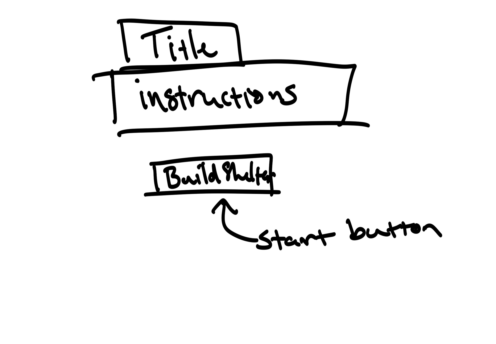
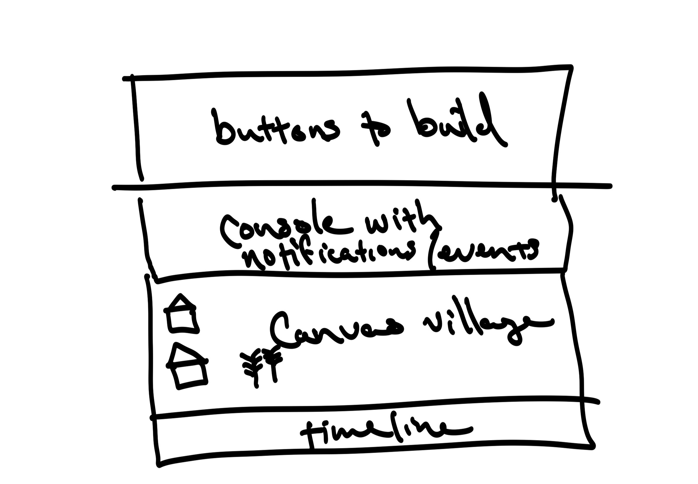

# *it's getting colder*
## inspired by Avery Alder's *The Quiet Year*

It is spring, and your community has just weathered a devastating winter. Now, to rebuild.

*it's getting colder* is a text-based clicker with a timeline. You have one year to build and assemble resources to prepare for the winter to come. When it arrives, randomly generated conditions will determine whether you have survived.

### Technologies
*it's getting colder* utilizes HTML5, CSS, and Vanilla Javascript to handle interactions and logic. The primary method of interacting will be through a series of buttons. The game will also include an HTML canvas, which displays your burgeoning community.

Layout is handed with CSS Grid.

### Wireframes

Title and instructions, with a button to start the game by taking the first action.

Primary game layout will consist of a series of buttons allowing you to take actions, a console where you will be notified of the seasonal 'events,' a canvas that displays your community, and a progress bar/timeline that shows how close you are to the end of the game.

### MVP Goals
* a year of gameplay, consisting of three 'events' per season
* the option to name your community and other elements as they are added
* branching story events, based on player decisions during each event
* a system of iterators that generate resources based on the contents of the community
* a basic HTML canvas that displays the contents of the village
* randomly second one of two win conditions at the end of the game, and notify the player of whether they won
* basic sound effects triggered by events

### Stretch Goals
* basic 'physics' for the canvas, so that items drop in from the top
* longer seasons, with the option to select the number of events per season
* more potential win conditions, influenced by player decisions during events
* snow animation on the canvas as winter approaches

#### Bugs
